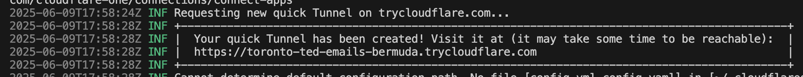

# Looker Extension Elevate 25 - Extension Framework Hands On Lab

# Getting started

1. In a new tab, open [shell editor](https://shell.cloud.google.com/?show=ide). If you haven't used this before, follow the tutorial or click Mark Done.
2. Click the Explorer icon on the left sidebar
3. Click the **Clone repository** button
4. Enter the following repo and clone: `https://github.com/bwebs/simple-looker-extension-elevate-25`. You can keep it in the default folder. When asked, click Open, not Open in New Window 
5. Cmd+shift+p (alternatively click the box in the top and center of the screen, click Show and Run Commands > ) and seearch and select `Terminal: Create New Terminal`
6. Run `npm install && npm run dev`. This should take a minute or so to complete. You will see `webpack compiled successfully` in the terminal.
7. Open another terminal using the same command (or press the + button on the top right of the terminal section) and run: `curl -s https://raw.githubusercontent.com/bwebs/simple-looker-extension-elevate-25/refs/heads/main/tunnel.sh | sh` to start a cloudflare tunnel. Once complete, scroll up and find the url in the box. It looks like this:



8. Open chrome and visit `https://<tunnel-url>/bundle.js`. You should see some javascript code when it loads; if not please reach out for help.
9.  Open up a looker project and Copy the text below and paste it into the manifest.lkml file. Make sure to replace your server url in the url field. ** NOTE** We recommend using a demo instance like [demoeast](https://demoeast.cloud.looker.com), [demowest](https://demowest.cloud.looker.com), or [demoemea](https://demoemea.cloud.looker.com) if you have access to one. If you do not, you can use any Looker instance, but later in the tutorial you may need to change dashboard ids and other values to match your instance.
    
```
application: simple_extension {
  label: "Simple Extension"
  url: "<serveo-url>/bundle.js"
  # file: "bundle.js"
  entitlements: {
    core_api_methods: ["me"]
  }
}
```

10.  Open one more terminal window and run `git checkout module1-start --force` to get the starter code for this module.
10.  Refresh your looker window and go to Looker navigation sidebar. Go to Applications and open Simple Extension. 
11.  :tada: You should an extension like this


12.  Now start the tutoral by going to [module 1](./module-1/0-overview.md) 
  
:::warning Tunnel Disconnect

It is possible that your tunnel will disconnect. It may happen because of inactivity or because your terminal stops. If this happens; your extension will stop loading working when you refresh the page. If this happens, you can reconnect by running `curl -s https://raw.githubusercontent.com/bwebs/simple-looker-extension-elevate-25/refs/heads/main/tunnel.sh | sh` again in the terminal. Then go to your manifest and update the url to the new tunnel url (don't forget the `/bundle.js`).
 
:::