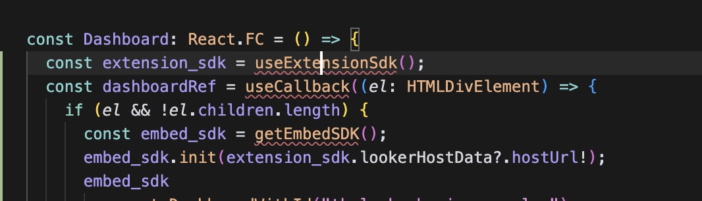

# Embedding a Dashboard

## 🎯 Goal

In this step, you'll embed a Looker dashboard into your extension using the Embed SDK. Along the way, you'll learn how to import packages, configure your React component, and use React's `useCallback` hook to control how the dashboard loads.

## 🛠️ Instructions

1. Open up the [Dashboard.tsx](../../../src/Dashboard.tsx) file.
2. In most of the `.tsx` files you will edit in the tutorial, there are five main things you will see in the file.
    - Imports at the top of the file
    - Optionally some styled components like `const StyledCard = styled(Card)``;`
    - Optionally some types like `interface MyType {}`
    - A React component like `const Component: React.FC = () => {` function that also includes a `return (...)` that contains React TSX code.
    - A `const dashboardRef = useCallback((el: HTMLDivElement) => {` function that uses the `useCallback` hook to control how the dashboard loads.

> **Note:** You will usually need to update only the imports at the top or the contents of the React component. For the react component, we will be explicit whether we are telling you to replace the entire component or just update part of it.


3. Replace the full Dashboard component to the following:

    **before**

    ```tsx
    const Dashboard: React.FC = () => {
      return (
        <StyledCard p="xsmall" raised borderRadius="large">
          Dashboard Goes Here
        </StyledCard>
      );
    };
    ```

    **after**

    ```tsx
    const Dashboard: React.FC = () => {
      const extension_sdk = useExtensionSdk();
      const dashboardRef = useCallback((el: HTMLDivElement) => {
        if (el && !el.children.length) {
          const embed_sdk = getEmbedSDK();
          embed_sdk.init(extension_sdk.lookerHostData?.hostUrl!);
          embed_sdk
            .createDashboardWithId("thelook::business_pulse")
            .appendTo(el)
            .build()
            .connect()
            .catch((error: any) => {
              console.error("Error embedding dashboard:", error);
            });
        }
      }, []);

      return (
        <StyledCard p="xsmall" raised borderRadius="large" ref={dashboardRef} />
      );
    };
    ```

    If you are not using a demo instance, you will need to change the dashboard id to the id of the dashboard you want to embed. You can find the dashboard id by going to the dashboard in Looker and copying the id from the url. It will look like this: `/dashboards/<dashboardid>`.

    This code uses the [Looker Embed SDK](https://cloud.google.com/looker/docs/embed-sdk-intro) to dynamically embed a dashboard inside your extension using an iframe. It creates a dashboard instance with a specific ID ("thelook::business_pulse"), attaches it to a DOM element, and connects it to Looker.

    The `embed_sdk` object provides a clean, chainable API to:
    - Initialize the connection to your Looker host
    - Embed the dashboard
    - Connect and handle errors if the embed fails


4. You should now see some errors in your IDE that look like this:

    

5. Resolve the imports by adding the following to the top of the file. Through the tutorial, we try to be explicit about adding imports, but you should be able to identify the missing imports by the red squiggly lines in your IDE.

```tsx
import { getEmbedSDK } from "@looker/embed-sdk";
import useExtensionSdk from "./hooks/useExtensionSdk";
import { useCallback } from "react";
```

6. Refresh the extension in the browser. You should now see the dashboard embedded in the card on the right. If you do not, make sure you set up the application entitlements correctly in the [project setup](1-project-setup.md) step (`use_embeds: yes` and `use_iframes: yes`).

---

Learn more:

- [📘 Importing JavaScript Packages](./glossary.md#importing-javascript-packages)
- [📘 npm Package Manager](./glossary.md#npm)
- [📘 Embed SDK](./glossary.md#embed-sdk)
- [📘 React's useCallback](./glossary.md#reacts-usecallback)
