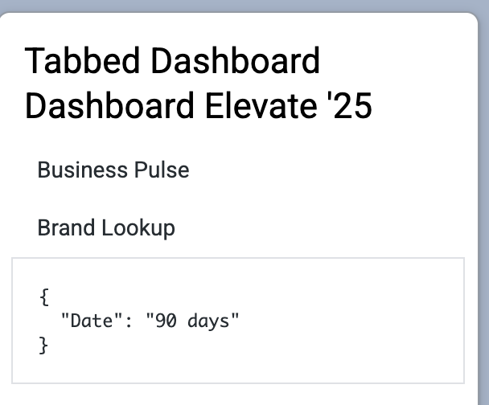

# Dashboard Titles with `dashboard` API

## 🎯 Goal

You'll enhance your extension by using the `dashboard` API to fetch and display dashboard titles instead of IDs. We will bring in the sdk, use it to grab the titles and display them in the sidebar. We will also update the manifest to include the `dashboard` core_api entitlement.

By the end of this step, you'll have a more user-friendly extension that provides a better user experience.

## 🛠️ Instructions

To get started working on Module 3, run:

```
git checkout module3-start --force
```

To jump to the end of this module in case you run out of time, run:

```
git checkout module3-end --force
```

1. Navigate to the [Sidebar.tsx](../../../src/Sidebar.tsx) file.
2. Retrieve the sdk for the useSDK hook. You can place this at the top of the Sidebar component.

```tsx
const sdk = useSdk();
```

3. Import the useSdk hook. `import useSdk from "./hooks/useSdk";`
4. We have written the new sidebar List component for you. You can replace the full `<List>...</List>` with the following code.

   ```tsx
   <List>
     {show_dashboards.map((dashboard_id: string) => {
       const Item = ({ dashboard_id }: { dashboard_id: string }) => {
         const db = useSWR(dashboard_id, () =>
           sdk.ok(sdk.dashboard(dashboard_id, "id,title"))
         );
         return (
           <ListItem
             key={dashboard_id}
             itemRole="link"
             selected={dashboard?._currentPathname?.startsWith(
               `/embed/dashboards/${dashboard_id}`
             )}
             onClick={() => {
               dashboard?.loadDashboard(
                 dashboard_id +
                   "?" +
                   Object.entries(global_filters)
                     .map(([key, value]) => `${key}=${value}`)
                     .join("&")
               );
             }}
           >
             {db.data?.title || dashboard_id}
           </ListItem>
         );
       };
       return <Item key={dashboard_id} dashboard_id={dashboard_id} />;
     })}
   </List>
   ```

5. Import the useSWR hook. `import useSWR from "swr";`
6. In your project `manifest.lkml` file, you will need to add `dashboard` core_api_methods entitlement
7. Refresh the page and you should see the dashboard titles instead of the dashboard ids.


