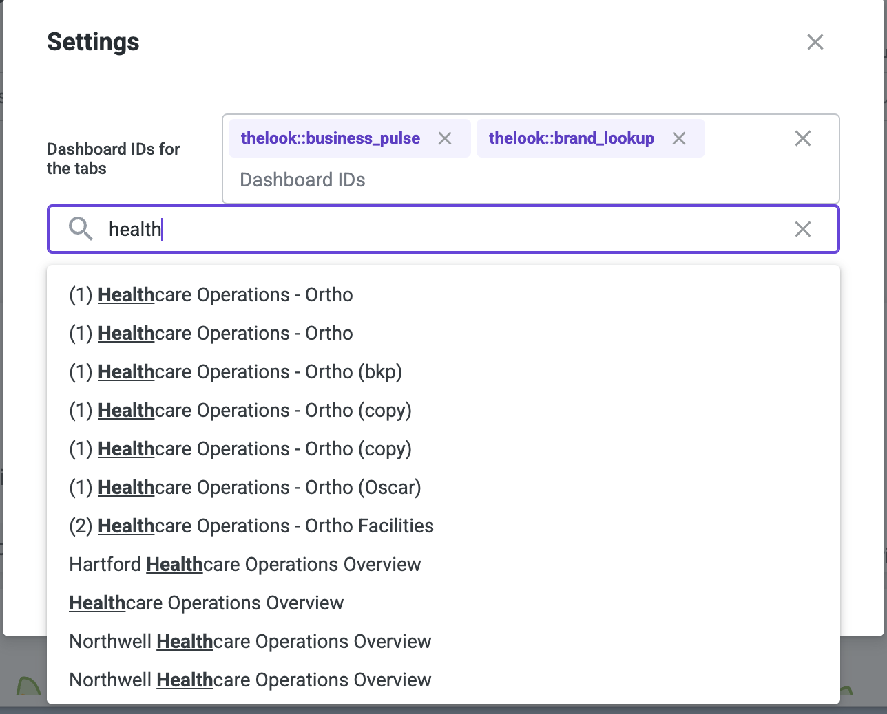

# Searching for dashboards in the configuration

## 🎯 Goal

In this section we'll make our settings we'll show you to turn your configuration settings from hard coded ids into a searchable list using the `search_dashboards` api, and debouncing values. Debouncing is a an important technique to prevent excessive API calls; it allows for the user to type out a search query without making a request for each character.

## 🛠️ Instructions

1. Navigate to the [Settings.tsx](../../../src/Settings.tsx) file.
2. First we want to include some functions that are going to [debounce values](./glossary.md#debouncing-input-values) and handle the search with the Looker API. In the Settings component, add the following code:

   ```tsx
   const [debounced_search, setDebouncedSearch] = useDebounceValue("", 500);
   const sdk = useSdk();
   const searched_dashboards = useSWR(
     `debounced_search=${debounced_search}`,
     () =>
       sdk.ok(
         sdk.search_dashboards({
           limit: 50,
           title: debounced_search?.length
             ? `%${debounced_search}%`
             : undefined,
           sorts: "title",
         })
       )
   );
   ```

3. Make sure to import the following at the top of the file

   ```tsx
   import useSWR from "swr";
   import useSdk from "./hooks/useSdk";
   import { InputSearch } from "@looker/components";
   import { useDebounceValue } from "usehooks-ts";
   ```

4. We have written an additional Looker SearchInput component for you to use alongisde of the `InputChips` component. Underneath the end of the Space component (after `</Space>` ), add the following code:

   ```tsx
   <InputSearch
     options={searched_dashboards.data?.map((d) => ({
       value: d.id!,
       label: d.title!,
     }))}
     onChange={(value: string) => setDebouncedSearch(value)}
     onSelectOption={(v) => handleChange([...dashboard_ids, v!.value])}
     changeOnSelect={false}
     placeholder="Search and click to add"
   />
   ```

5. Make sure you add `search_dashboards` to the `core_api_methods` entitlement in your `manifest.lkml` file.
6. Refresh the page, click the settings tab and search for a dashboard title.
7. You can now search for dashboards and add them to the list; clicking them will add to the list..



## Learn more

- [Debouncing](./glossary.md#debouncing-input-values)
