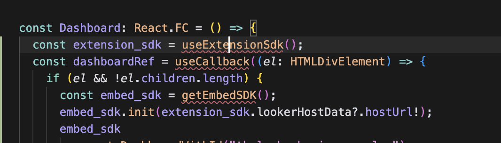

# Embedding a Dashboard

## 🎯 Goal

In this step, you'll embed a Looker dashboard into your extension using the Embed SDK. Along the way, you'll learn how to import packages, configure your React component, and use React's `useCallback` hook to control how the dashboard loads.

## 🛠️ Instructions

1. Open up the [Dashboard.tsx](../../src/Dashboard.tsx) file.

2. Update the Dashboard component to the following:
    ```tsx
    const Dashboard: React.FC = () => {
      const dashboardRef = useCallback((el: HTMLDivElement) => {
        if (el && !el.children.length) {
          const embed_sdk = getEmbedSDK();
          embed_sdk.init(extension_sdk.lookerHostData?.hostUrl!);
          embed_sdk
            .createDashboardWithId("thelook::business_pulse")
            .appendTo(el)
            .build()
            .connect()
            .catch((error: any) => {
              console.error("Error embedding dashboard:", error);
            });
        }
      }, []);

      return (
        <StyledCard p="xsmall" raised borderRadius="large" ref={dashboardRef} />
      );
    };
    ```
    This code uses the [Looker Embed SDK](https://cloud.google.com/looker/docs/embed-sdk-intro) to dynamically embed a dashboard inside your extension using an iframe. It creates a dashboard instance with a specific ID ("thelook::business_pulse"), attaches it to a DOM element, and connects it to Looker.

    The `embed_sdk` object provides a clean, chainable API to:
    - Initialize the connection to your Looker host
    - Embed the dashboard
    - Connect and handle errors if the embed fails


3. You should now see some errors in your IDE that look like this:

    

4. Resolve the imports by adding the following to the top of the file:

    ```tsx
    import { getEmbedSDK } from "@looker/embed-sdk";
    import useExtensionSdk from "./hooks/useExtensionSdk";
    import { useCallback } from "react";
    ```

---

Learn more:

- [📘 Importing JavaScript Packages](./glossary.md#importing-javascript-packages)
- [📘 npm Package Manager](./glossary.md#npm)
- [📘 Embed SDK](./glossary.md#embed-sdk)
- [📘 React's useCallback](./glossary.md#reacts-usecallback)

---

### ➡️ Next: [Saving Dashboard State](3-saving-dashboard-state.md) 